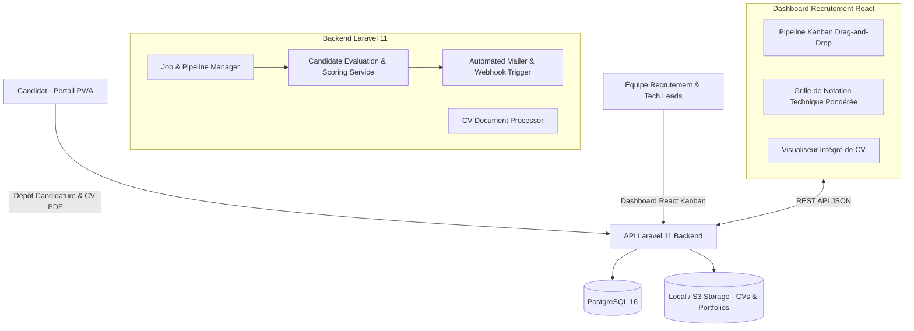

# 🎯 TalentPulse / HireHub Enterprise — ATS & Tech Recruitment Platform

[](https://www.php.net/)
[](https://laravel.com/)
[](https://react.dev/)
[](https://www.typescriptlang.org/)
[](https://www.postgresql.org/)
[](https://tailwindcss.com/)

Plateforme collaborative de gestion des recrutements (ATS) pour équipes Tech & Produit, avec pipeline en colonnes Kanban, grille d'évaluation technique normalisée (Back-end, Front-end, QA, Culture Fit), parsing de CV et workflows automatisés d'e-mails.

---

## 🏛️ Architecture Technique



---

## 📂 Structure du Répertoire

```text
projet-3-talentpulse-ats-platform/
├── docker-compose.yml          # Orchestration complète (Postgres, Laravel, React)
├── README.md                   # Documentation technique
├── backend/                    # API Laravel 11
│   ├── app/
│   │   ├── Http/Controllers/   # CandidateController, JobOfferController
│   │   ├── Models/             # Candidate, JobOffer, EvaluationScore
│   │   └── Services/           # CandidateScoringService
│   ├── routes/api.php          # Endpoints ATS
│   ├── composer.json
│   └── Dockerfile
└── frontend/                   # Interface ATS React
    ├── src/
    │   ├── components/         # Pipeline Kanban, Modale d'évaluation
    │   ├── types/              # Types candidats, offres, scores
    │   ├── App.tsx
    │   └── main.tsx
    ├── package.json
    └── vite.config.ts
```

---

## 🚀 Démarrage Rapide

```bash
cd projet-3-talentpulse-ats-platform
docker-compose up -d --build
# Dashboard sur http://localhost:3002
# API Backend sur http://localhost:8002/api/v1
```
